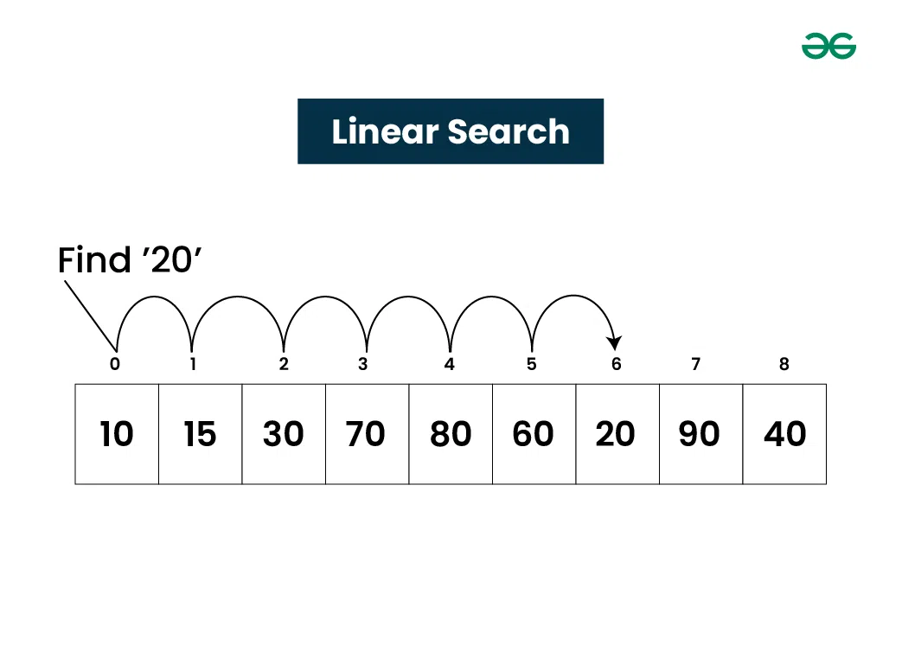
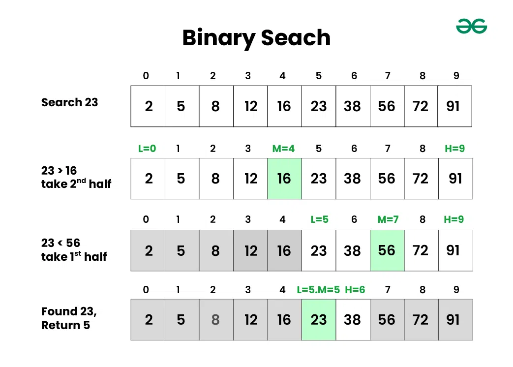
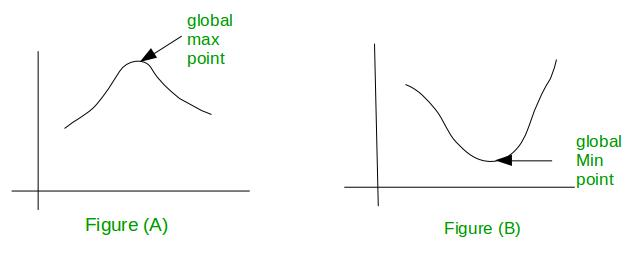
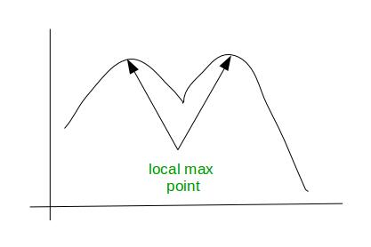
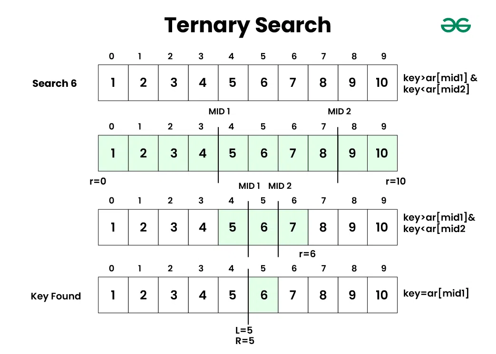

Searching algorithms are essential tools in computer science used to locate specific items within a collection of data. These algorithms are designed to efficiently navigate through data structures to find the desired information, making them fundamental in various applications such as databases, web search engines, and more.

What is Searching?

Searching is the fundamental process of locating a specific element or item within a collection of data. This collection of data can take various forms, such as arrays, lists, trees, or other structured representations. The primary objective of searching is to determine whether the desired element exists within the data, and if so, to identify its precise location or retrieve it. It plays an important role in various computational tasks and real-world applications, including information retrieval, data analysis, decision-making processes, and more.

Searching terminologies:
    Target Element:
        In searching, there is always a specific target element or item that you want to find within the data collection. This target could be a value, a record, a key, or any other data entity of interest.

    Search Space:
        The search space refers to the entire collection of data within which you are looking for the target element. Depending on the data structure used, the search space may vary in size and organization.

Types of Searching Algo's
    Deterministic : Some searching algorithms, like binary search, are deterministic, meaning they follow a clear, systematic approach.
    Non-Deterministic : Others such as linear search, are non-deterministic, as they may need to examine the entire search space in the worst case.

Importance of Searching in DSA:
    * Efficiency: Efficient searching algorithms improve program performance.
    * Data Retrieval: Quickly find and retrieve specific data from large datasets.
    * Database Systems: Enables fast querying of databases.
    * Problem Solving: Used in a wide range of problem-solving tasks.

Applications of Searching:
    Searching algorithms have numerous applications across various fields. Here are some common applications:

    * Information Retrieval: Search engines like Google, Bing, and Yahoo use sophisticated searching algorithms to retrieve relevant information from vast amounts of data on the web.
    * Database Systems: Searching is fundamental in database systems for retrieving specific data records based on user queries, improving efficiency in data retrieval.
    * E-commerce: Searching is crucial in e-commerce platforms for users to find products quickly based on their preferences, specifications, or keywords.
    * Networking: In networking, searching algorithms are used for routing packets efficiently through networks, finding optimal paths, and managing network resources.
    * Artificial Intelligence: Searching algorithms play a vital role in AI applications, such as problem-solving, game playing (e.g., chess), and decision-making processes
    * Pattern Recognition: Searching algorithms are used in pattern matching tasks, such as image recognition, speech recognition, and handwriting recognition.

Searching Algorithms:

    * Linear Search
    * Sentinel Linear Search
    * Binary Search
    * Meta Binary Search | One-Sided Binary Search
    * Ternary Search
    * Jump Search
    * Interpolation Search
    * Exponential Search
    * Fibonacci Search
    * The Ubiquitous Binary Search

Short into to all these Searching Algo's:

1. Linear Search
Linear Search, also known as Sequential Search, is one of the simplest and most straightforward searching algorithms. It works by sequentially examining each element in a collection of data(array or list) until a match is found or the entire collection has been traversed.

Linear Search
Algorithm of Linear Search:

    * The Algorithm examines each element, one by one, in the collection, treating each element as a potential match for the key you’re searching for.
    * If it finds any element that is exactly the same as the key you’re looking for, the search is successful, and it returns the index of key.
    * If it goes through all the elements and none of them matches the key, then that means “No match is Found”.

Complexity Analysis of Linear Search:

    Time Complexity:
        * Best Case: In the best case, the key might be present at the first index. So the best case complexity is O(1)
        * Worst Case: In the worst case, the key might be present at the last index i.e., opposite to the end from which the search has started in the list. So the worst-case 
            complexity is O(N) where N is the size of the list.
        * Average Case: O(N)
    Auxiliary Space: O(1) as except for the variable to iterate through the list, no other variable is used.

When to use Linear Search:
    * When there is small collection of data.
    * When data is unordered.

2. Binary Search
Binary Search is defined as a searching algorithm used in a sorted array by repeatedly dividing the search interval in half. The idea of binary search is to use the information that the array is sorted and reduce the time complexity to O(log N).

Binary Search Algorithm
Algorithm of Binary Search:
    * Divide the search space into two halves by finding the middle index “mid”.
    * Compare the middle element of the search space with the key.
    * If the key is found at middle element, the process is terminated.
    * If the key is not found at middle element, choose which half will be used as the next search space.
        * If the key is smaller than the middle element, then the left side is used for next search.
        * If the key is larger than the middle element, then the right side is used for next search.
    * This process is continued until the key is found or the total search space is exhausted.

Complexity Analysis of Binary Search:

    * Time Complexity:
        * Best Case: O(1) – When the key is found at the middle element.
        * Worst Case: O(log N) – When the key is not present, and the search space is continuously halved.
        * Average Case: O(log N)
    * Auxiliary Space: O(1)

When to use Binary Search:
    * When the data collection is monotonic (essential condition) in nature.
    * When efficiency is required, specially in case of large datasets.

3. Ternary Search
Ternary Search is a searching algorithm that divides the search space into three parts instead of two, as in Binary Search. It is very useful in the case of unimodal functions.

Unimodal Function :

    A function f(x) is said to be unimodal function if for some value m it is monotonically increasing for x≤m and monotonically decreasing for x≥m. For function f(x), maximum value is f(m) and there is no other local maximum.
    See below figure (A) and (B):

    In figure (A), graph has only one maximum point and rest of the graph goes down from there and in figure (B) graph has only one minimum point and rest of the graph goes up from there. Thus, we can say that if a function has global maximum or global minimum is considered as Unimodal function.

    Consider a function f(x) in the interval [a, b] and we have to determine value of x for which the function is maximised. The function strictly increase in the interval [a, x] and strictly decrease in the interval [x, b]. For this purpose we can use modified binary search to determine the maximum or value of that function.

Bimodal Function :
A function is said to be bimodal function if it has two local minima or maxima. Generally bimodal function indicates two different groups. For example, In a class there are lot of students getting grade A and a lot getting grade D. This tell us that in a class there are two different group of student, one group is under-prepared and other group is over-prepared. See this figure for better understanding:

Note –
    With bimodal function and above, we don’t know if an extreme is local or global unless we know the entire graph.
    With unimodal function any extreme we find is guaranteed to be the global extreme.

Algorithm Ternary Search:

    * In Ternary Search, start with two midpoints, oneThird and twoThirds, which divide the collection into three roughly equal parts.
    * Compare the elements at oneThird and twoThirds with the target key you’re searching for.
    * Three Possibilities:
        - If oneThird contains the key, you’re done and return the index of oneThird.
        - If twoThirds contains the key, you’re done and return the index of twoThirds.
        - If the key is less than the element at oneThird, eliminate the rightmost one-third of the collection and focus on the left two-thirds.
    * If the key is greater than the element at twoThirds, eliminate the leftmost one-third of the collection and focus on the right two-thirds.
    * Repeat this process iteratively until either key is found or determine that it’s not present in the collection.

Time Complexity:
    Best Case: O(1)
    Worst Case: O(log3N)
    Average Case: O(log3N)
Auxiliary Space: O(1)

4. Jump Search
Jump Search is another searching algorithm that can be used on sorted collections (arrays or lists). The idea is to reduce the number of comparisons by jumping ahead by fixed steps or skipping some elements in place of searching all elements.

Let’s consider the following array: (0, 1, 1, 2, 3, 5, 8, 13, 21, 34, 55, 89, 144, 233, 377, 610).

The length of the array is 16. The Jump search will find the value of 55 with the following steps assuming that the block size to be jumped is 4.

    * Jump from index 0 to index 4;
    * Jump from index 4 to index 8;
    * Jump from index 8 to index 12;
    * Since the element at index 12 is greater than 55, we will jump back a step to come to index 8.
    * Perform a linear search from index 8 to get the element 55.

Time Complexity of Jump Search:

    * Time Complexity: O(√n), where “n” is the number of elements in the collection. This makes it more efficient than Linear Search but generally less efficient than Binary Search for large datasets.
    * Auxiliary Space: O(1), as it uses a constant amount of additional space for variables.

Performance Comparision:
    linear search < jump search < binary search

5. InterPolation Search
    Interpolation Search is an efficient searching algorithm for sorted collections of data, such as arrays or lists. It is an improvement over Binary Search, particularly when the data is uniformly distributed.

6. Fibonacci Search
    Fibonacci Search is an efficient searching algorithm used for finding a target value in a sorted collection, such as an array or list. It is similar in principle to Binary Search but uses Fibonacci numbers to determine the positions to be compared.

7. Exponential Search
    Exponential Search is a searching algorithm designed to find a target value in a sorted collection, such as an array or list. It combines elements of Binary Search and Linear Search to efficiently locate the target, especially when its position is near the beginning of the collection.

Importance of Data Structures for Searching:
    * Arrays
        - Allow for fast linear search, where each element is checked sequentially.
        - Efficient for binary search, which divides the array into halves until the target element is found.
    * Linked Lists:
        - Useful for inserting and deleting elements efficiently.
        - Slower for searching as each node must be traversed sequentially.
    * Hash Tables:
        - Provide constant-time search by storing data in a key-value pair format.
        - The key is used to compute the location of the data in the table.
    * Trees:
        - Organize data hierarchically, enabling efficient binary search.
        - Support range queries, where all elements within a specified range can be retrieved efficiently.

Specific Examples:

    * Linear Search: Arrays are ideal for linear search due to their contiguous memory layout.
    * Binary Search: Binary search is most efficient with sorted arrays, as it can divide the array into halves to quickly narrow down the search space.
    * Hashing: Hash tables are used in scenarios where fast and efficient lookups are required, such as in databases or in-memory caches.
    * Binary Search Tree (BST): BSTs allow for efficient binary search and range queries. The data is organized in a hierarchical structure, where each node contains a key and a value.

What is the purpose of the search algorithm?