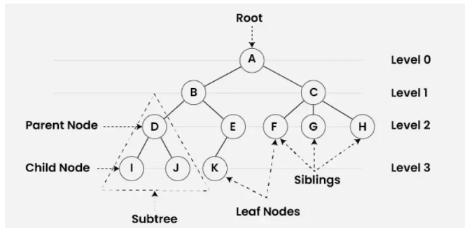
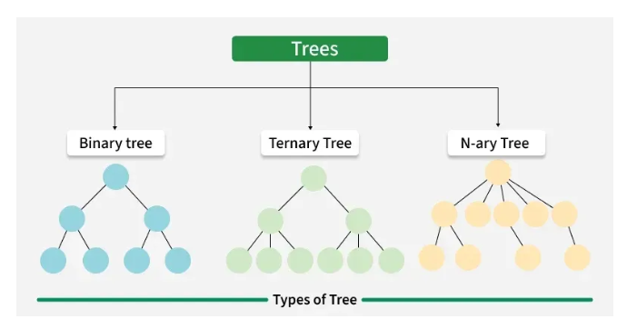
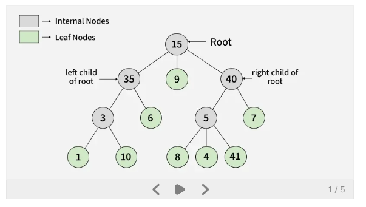
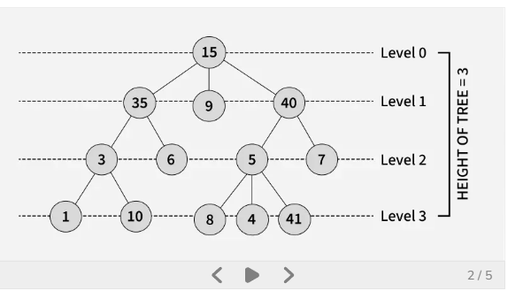
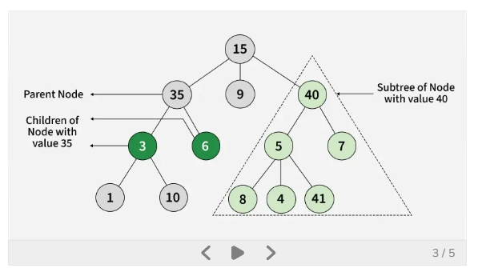
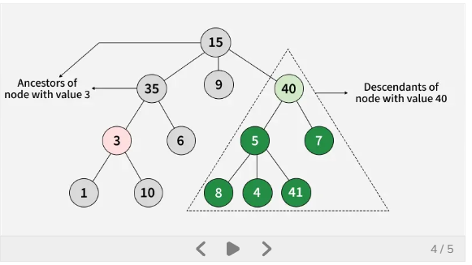
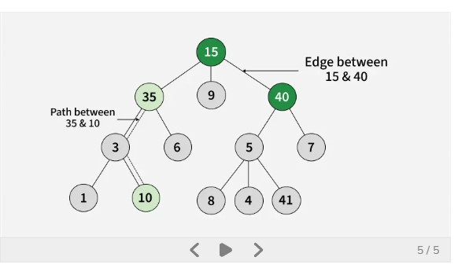
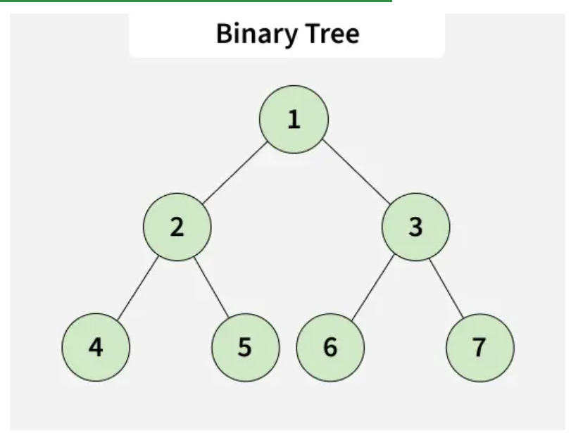
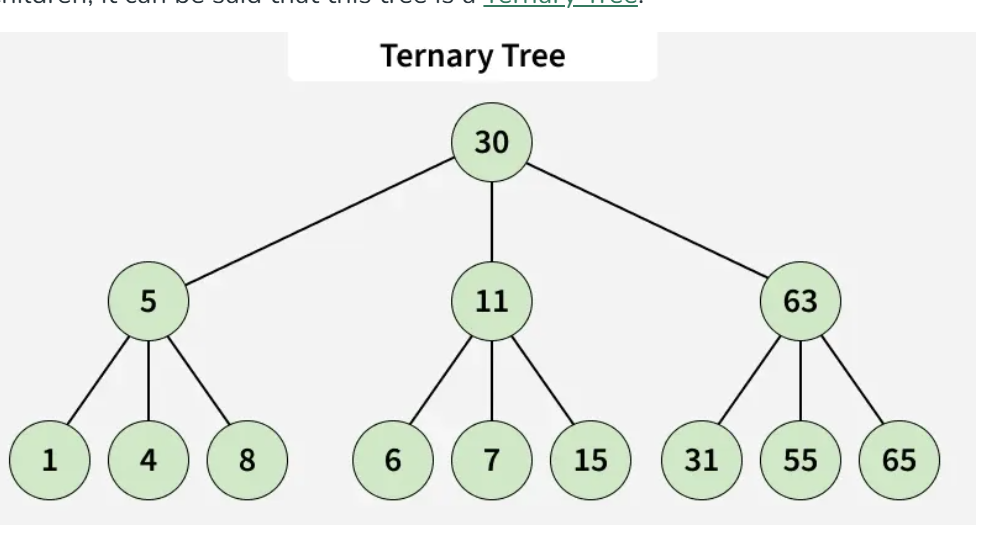
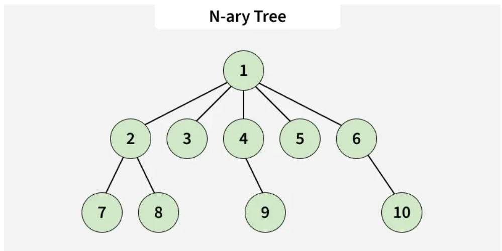

# Tree Data Structure

It is a non linear data structre where a collection of elements known as nodes are connected to each other via edges such that there exists exactly one path between any two nodes.

# Types of Tree:
    1. Binary Tree
    2. Ternary Tree
    3. N-ary tree

A tree is a hierarchical data structre used to organize and represent data in a parent-child relationship.
It consists of nodes, where the topmmost node is called the root, and every other node can have one or more child nodes.

# Basic Terminology:
    * Parent Node: A node that is an immediate predecessor of another node.
    * Child Node: A node that is an immediate successor of another node.
    * Root Node: The topmost node in a tree, which does not have a parent.
    * Lead Node(External Node): Node that do not have any children.
    * Ancestor: Ant node on the path from the root to a given node.
    * Descendant: A node x is adescendant of another node y if u is an ancestor of x.
    * Sibling: Node that share the same parent, 
    * Level of a node: The nuber of edges in the path from the rooot to that node. The root node is at level 0.
    * Internal Node: A node with at least one child.
    * Neighbour of a Node: The parent or children of a node.
    * Subtree: A node and all its descendants from a subtree.

Class representation of a Node in a Tree Data Structure:

# Node structure of a tree
    class Node:
        def __init__(self, x):
            self.data = x
            self.children = []

Types of Tree Data Structures :
    Tree data structures can be classified based on the number of children each node can have.

# Binary Tree:
    Each node can have a maximum of two children.

    Full Binary Tree – every node has either 0 or 2 children.
    Complete Binary Tree – all levels are fully filled except possibly the last, which is filled from left to right.
    Balanced Binary Tree – height difference between left and right subtrees of every node is minimal.

# Ternary Tree:
    Each node can have at most three children, often labeled as left, middle, and right.

    N-ary Tree (or Generic Tree):
    Each node can have any number of children.
    Each node typically contains: Some data , A list of references to its children (duplicates are not allowed).
    Unlike linked lists, nodes store references to multiple child nodes.
    Please refer Types of Trees in Data Structures(https://www.geeksforgeeks.org/dsa/types-of-trees-in-data-structures/) for details.

# Basic Operations:
    * Create -> Create a tree in the data structure
    * Insert -> Insert data in the tree
    * Search -> Search specific data in the tree to check wether the data is present in the tree or not
    * Traversal 
        * DFS -> Depth-First-Traversal
        * BFS -> Breadth-First-Traversal

# Properties of Tree Data Structure:
    * Number of edges: An edges is the connection b/w two nodes. A tree with N nodes will always have N-1 edges. There is exactly one path from any node to any other node in the tree.
    * Depth of a node: The depth of a node is the length of the path from the orot to that node. Each edge in the path adds 1 unit to the length. Equivalently, it is the number of edges from the root tot the node.
    * Height of the tree: The height of the trree is the length of the longest path from the root to any leaf node.
    * Degree of a node: The degree of a node is the number of subtrees attached to it(i.e. the number of children it has)
        A leaf node has a degree of 0.
        The degree of the tree is the maximum degree among all nodes in the tree.

****************************************************************************************************************************************************************************************************************************

# Types of Tree

1. # Binary Tree

    A binary tree is a tree data structure where each node has at most two children. These two children are usually referred to as the left child and right child. 
    Consider the tree below. Since each node of this tree has at most 2 children, it can be said that this tree is a Binary Tree.

    

    # Types of Binary Tree

        * Binary Search Tree (BST) and its Variations: A BST is a binary tree where each node has at most two children,
        and for each node, the left child’s value is smaller than the node’s value, and the right child’s value is greater
        * Binary Indexed Tree (Fenwick Tree): A data structure that uses a binary tree to efficiently compute and update prefix sums in an array
        * Balanced Binary Tree: A binary tree where the difference in heights between the left and right subtrees of any node is minimal
        (often defined as at most 1). Examples of Balanced Binary Tree are AVL Tree, Red Black Tree and Splay Tree.

    # Properties of a Binary Tree
        * The maximum number of nodes at level L of a binary tree is 2L.
        * The maximum number of nodes in a binary tree of height H is 2H+1 – 1.
        * Total number of leaf nodes in a binary tree = total number of nodes with 2 children + 1.
        * In a Binary Tree with N nodes, the minimum possible height or the minimum number of levels is ⌊log2N⌋.
        * A Binary Tree with L leaves has at least ⌈log2L⌉+ 1 levels.

2. # Ternary Tree
    A Ternary Tree is a tree data structure in which each node has at most three children. These t wo children are usually referred to as the left child, mid child and right child. 
    

    # Examples of Ternary Tree
        * Ternary Search Tree: A ternary search tree is a special trie data structure where the child nodes of a standard trie are ordered as a binary search tree.
        * Ternary Heap: A type of heap where each node can have up to three children, though less common than binary heaps.

3. # N-ary Tree(Generic Tree)
    An N-ary tree is a generalization of a binary tree, such that each node can have at most N children.

    # Example Consider the tree below. Here, n=5, since each node of this tree has less than or equal to 5 children, it can be said that this tree is a n-ary tree for n = 5.
    

    # Examples of N-ary Tree
        * B-tree: A self-balancing search tree where nodes can have multiple children, usually used for indexing large databases.
        * B+ Tree: A B+ tree is a variation of the B-tree that only stores data in the leaf nodes, making range queries more efficient.
        * Trie (Prefix Tree): A tree where each node represents a character, and paths from the root to leaves represent strings. 
          It can have a variable number of children for each node, making it an N-ary tree.

